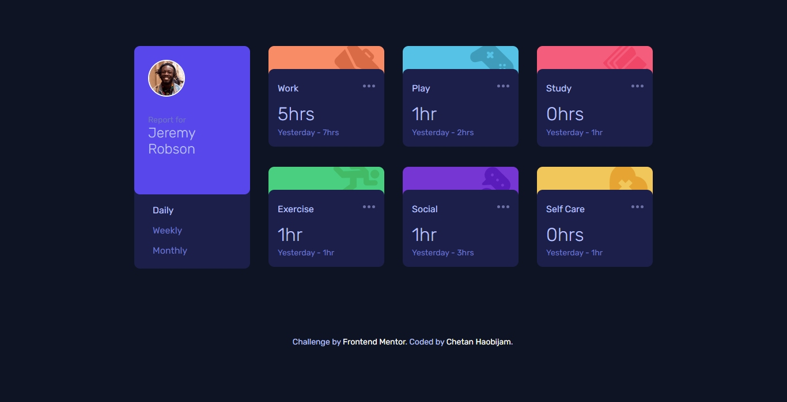

# Frontend Mentor - Time tracking dashboard solution

This is a solution to the [Time tracking dashboard challenge on Frontend Mentor](https://www.frontendmentor.io/challenges/time-tracking-dashboard-UIQ7167Jw). Frontend Mentor challenges help you improve your coding skills by building realistic projects. 

## Table of contents

- [Overview](#overview)
  - [The challenge](#the-challenge)
  - [Screenshot](#screenshot)
  - [Links](#links)
- [My process](#my-process)
  - [Built with](#built-with)
  - [What I learned](#what-i-learned)
  - [Continued development](#continued-development)
  - [Useful resources](#useful-resources)
- [Author](#author)

## Overview

### The challenge

Users should be able to:

- View the optimal layout for the site depending on their device's screen size
- See hover states for all interactive elements on the page
- Switch between viewing Daily, Weekly, and Monthly stats

### Screenshot




### Links

- Solution URL: [Time Tracking Dashboard Solution](https://github.com/chetanhaobijam/Time_Tracking_Dashboard)
- Live Site URL: [Time Tracking Dashboard Live Site](https://chetanhaobijam.github.io/Time_Tracking_Dashboard/)

## My process

### Built with

- Semantic HTML5 markup
- Flexbox
- CSS Grid
- SCSS
- Asynchronous Javascript
- Fetch API + JSON
- Mobile-first workflow

### What I learned

While building this project I learned a lot about Asynchronous Javascript Functions, JSON and how to call them in our web page by using Fetch API. I also learned how to lighten or darken an element background using SCSS Functions.

```css
.main:hover {
    background-color: lighten($dark-blue, 15%);
}
```

```js
const getData = async() => {
    try {
        const fetchData = await fetch("./data.json");
        const data = await fetchData.json();
        
        for(let i = 0; i < data.length; i++) {
            statHeader[i].textContent = data[i]["title"];

            // Daily Data
            daily.addEventListener("click", () => {
                let dailyCurrent = data[i]["timeframes"]["daily"]["current"];
                let dailyPrevious = data[i]["timeframes"]["daily"]["previous"];

                currentData[i].textContent = dailyCurrent + determineHours(dailyCurrent);
                previousData[i].textContent = "Yesterday - " + dailyPrevious + determineHours(dailyPrevious);
            })
            
            // Weekly Data
            weekly.addEventListener("click", () => {
                let weeklyCurrent = data[i]["timeframes"]["weekly"]["current"];
                let weeklyPrevious = data[i]["timeframes"]["weekly"]["previous"];

                currentData[i].textContent = weeklyCurrent + determineHours(weeklyCurrent);
                previousData[i].textContent = "Last Week - " + weeklyPrevious + determineHours(weeklyPrevious);
            })

            // Monthly Data
            monthly.addEventListener("click", () => {
                let monthlyCurrent = data[i]["timeframes"]["monthly"]["current"];
                let monthlyPrevious = data[i]["timeframes"]["monthly"]["previous"];

                currentData[i].textContent = monthlyCurrent + determineHours(monthlyCurrent);
                previousData[i].textContent = "Last Month - " + monthlyPrevious + determineHours(monthlyPrevious);
            })

        }

    }
    catch(error) {
        throw error;
    }
    finally {
        console.log("Asynchronous Data Operation Finished");
    }
}
```
### Continued development

I would like to learn more about Asynchronous Javascript and Fetch API. I would also like to learn to build such type of project in React.

### Useful resources

- [SCSS Documentation](https://sass-lang.com/documentation/syntax/) - This documentation help me in learning concepts about SCSS.
- [Fetch API Mozilla Web Documentation](https://developer.mozilla.org/en-US/docs/Web/API/Fetch_API) - This documentation help me in learning concepts about Fetch API and how to call them using Asynchronous JS Functions.

## Author

- GitHub Website - [chetanhaobijam](https://github.com/chetanhaobijam)
- Frontend Mentor - [@chetanhaobijam](https://www.frontendmentor.io/profile/chetanhaobijam)
- Twitter - [@chetanhaobijam](https://www.twitter.com/chetanhaobijam)
